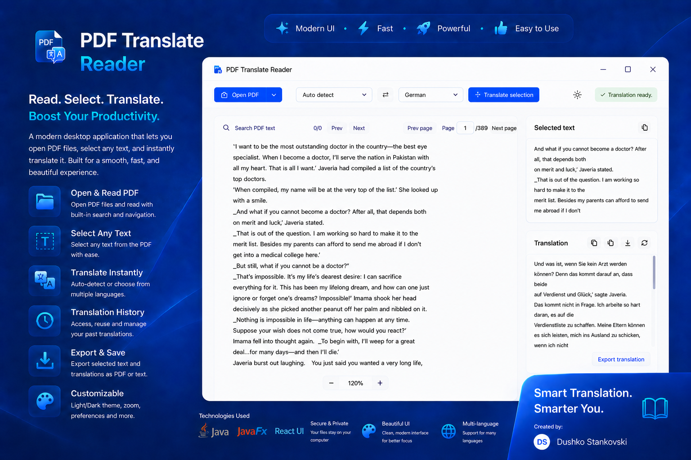

# PDF Translate Reader

PDF Translate Reader is a modern Windows desktop app for reading PDF files, selecting text, and translating the selected content instantly.

## Download

[**Download PDF Translate Reader Setup 1.0.2.exe**](installer/PDF%20Translate%20Reader%20Setup%201.0.2.exe)

The installer includes the required runtime, so users do not need to install Java separately.

## Technologies Used

- Java
- JavaFX
- React UI

## Features

- Open and read local PDF files.
- Select text directly from the PDF reader.
- Translate selected text instantly.
- Auto-detect or choose source and target languages.
- Search inside the loaded PDF and move between pages.
- Keep a local translation history.
- Export selected text, translated text, or full history.
- Switch between light blue and dark themes.
- Use a custom PDF reader scrollbar designed for both light and dark themes.
- Open the translation output in an expanded modal view.

## Notes

Translation requires internet access. PDF reading, text selection, search, theme preferences, recent files, and local history work inside the desktop app.

Created by **Dushko Stankovski**.
